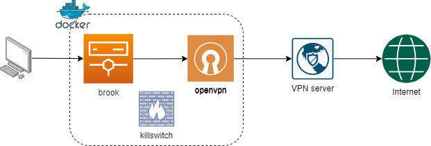

# Proxy through VPN connection in a Docker container



## Introduction
`vpn-as-a-container` is a SOCKS5 proxy server chaining with a NordVPN connection. It includes:

- OpenVPN connection to NordVPN service with selectable region
- SOCKS5 proxy server with [brook](https://github.com/txthinking/brook)
- Killswitch using `ufw`: only allow inbound from local network and outbound through `tun0` interface
- IPv6 disabled

## Prerequisites

- A [NordVPN](https://nordvpn.com) account
- NordVPN ovpn files from [here](https://downloads.nordcdn.com/configs/archives/servers/ovpn.zip) and extract it contents to `vpn/ovpn/config/`:

```Shell
$ curl -sSL -N https://downloads.nordcdn.com/configs/archives/servers/ovpn.zip -o vpn/ovpn/ovpn.zip && unzip -o vpn/ovpn/ovpn.zip -d vpn/ovpn/config/ && rm vpn/ovpn/ovpn.zip

$ tree -d
vpn
└── ovpn
    └── config
        ├── ovpn_tcp # contains tcp ovpn config files
        └── ovpn_udp # contains udp ovpn config files
```

## Starting the VPN Proxy

### Environment Variables

`REGION` is optional. The default server is set to `ie33`. `REGION` should match the supported NordVPN `.opvn` server config. 

`USERNAME` / `PASSWORD` - NordVPN account details.

`LOCAL_NETWORK` - The CIDR mask of the local IP addresses (e.g. 192.168.0.0/24, 10.1.1.0/24) which accesses the proxy.

### Bring up `vpncontainer`

```Shell
docker build -t ducmthai/vpncontainer .
docker run -d \
--cap-add=NET_ADMIN \
--device=/dev/net/tun \
--name=vpn_proxy \
--dns=103.86.96.100 --dns=103.86.99.100 \
--restart=always \
-e "REGION=ie33" \
-e "USERNAME=<nordvpn_username>" \
-e "PASSWORD=<nordvpn_password>" \
-e "LOCAL_NETWORK=192.168.0.0/24" \
-e "PROTOCOL=udp" \
-e "PROXY_PORT=3128" \
-v /etc/localtime:/etc/localtime:ro \
-p 3128:3128 \
ducmthai/vpncontainer
```

Substitute the environment variables for `REGION`, `USERNAME`, `PASSWORD`, `LOCAL_NETWORK`, `PROTOCOL` and `PROXY_PORT` as indicated. `udp` has much better performance.

A `docker-compose.yml` file is also provided. Supply NordVPN credentials and local network cidr in `.env` by providing values to `USERNAME`, `PASSWORD` and `LOCAL_NETWORK`.

Then start the container:

```Shell
docker-compose up -d
```

## Connecting to the VPN Proxy

Set proxy on host machine to socks5://127.0.0.1:${PROXY_PORT}.

```Shell
curl -x socks5h://127.0.0.1:3128 -L ifconfig.co/json
```

## Tested environments
- Raspberry Pi 4 B+ (4GB model)
- WSL 2 + Docker WSL2 technical preview (2.1.2.0)
- MacOS 10.15.4
- Linux Mint 19.2
- Windows 10 + VirtualBox Alpine guest

## Notes
WSL and VirtualBox use high CPU under loads.
