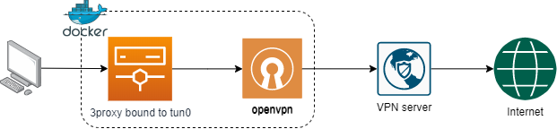

# Proxy through VPN connection in a Docker container
## Changelog

- v20220603: Add a `build.sh` script. Set s6-overlay version to 2.2.0.3. Update to version 3 pending.
- v20201208: Replace `brook` + `ufw` combo with `3proxy`. Reduce image size significantly.
- v20201116: Enable IPv6to4 fallback.
- v20201109: Use `s6-overlay` instead of `runit`. This change allow setting an environment variable through a file via prefix `FILE__`.
- v20200331: Initial version.


## Overview


## Introduction
`vpn-as-a-container` is a SOCKS5/HTTP proxy server chained with NordVPN connection, packed inside a container. It includes:

- OpenVPN UDP connection to NordVPN service with selectable region
- Proxy server with [3proxy](https://github.com/z3APA3A/3proxy)
- 3proxy built-in killswitch: only allows outbound through OpenVPN `tun0` interface
- Update NordVPN connection profiles monthly

## Build
### Set architecture
The container uses pre-built `s6-overlay` binaries. By default, it uses `amd64` s6 binaries. If your platform is different, modify `s6_arch` argument value in `Dockerfile` as follow:

```Dockerfile
ARG s6_arch=<your_platform_arch>
```
See [s6-overlay release page](https://github.com/just-containers/s6-overlay/releases/latest) to see if your platform is available. The argument can be set using `--build-arg` as below.

### Build the image
Use `build.sh`:

```Shell
sh build.sh amd64
```

Or, build the image with `docker` with BuiltKit enabled:

```Shell
DOCKER_BUILDKIT=1 docker build --build-arg s6_arch=aarch64 -t ducmthai:nord .
```

Alternatively, use `docker-compose build`:
```Shell
COMPOSE_DOCKER_CLI_BUILD=1 DOCKER_BUILDKIT=1 docker-compose build --build-arg s6_arch=aarch64
```

## Starting the VPN Proxy
### `vpn.config`

The main configuration file, contain the following values:

- `REGION`: (Optional) The default server is set to `ie33`. `REGION` should match the supported NordVPN `.opvn` server config.
- `USERNAME`: NordVPN username.
- `PASSWORD`: NordVPN password. Can set this variable via a file as the section below.
- `PROXY_MODE`: socks5 or http to use SOCKS5 or HTTP as proxy protocol.
- `PROTOCOL`: UDP or TCP which are supported by NordVPN.

## Environment variables

The environment variables needed for exposing the proxy to the local network:

- `PROXY_PORT`: Proxy port
- `HC_PORT`: Healthcheck port. A container internal port used by `wget` to check if the proxy is working through VPN.
- `LOCAL_NETWORK`: The CIDR mask of the local IP addresses (e.g. 192.168.0.1/24, 10.1.1.0/24) which will be acessing the proxy. This is so the response to a request can be returned to the client (i.e. your browser).
- `NORD_PROFILES_UPDATE`: Whether to update OpenVPN profiles or not. Possible values: yes|no.
- `EXT_IP`: Your external IP. Used only for healthcheck. You can get your current external IP on [ifconfig.co](https://ifconfig.co/ip)

These variables can be specified in the command line or in the `.env` file in the case of `docker-compose`.

### Set password via file

Passwords can be set using a `FILE__` prefixed environment variable where its value is path to the file contains the password:

```Shell
FILE__PASSWORD=/vpn/vpnpasswd
```

### Start with `docker run`

```Shell
docker build -t ducmthai/vpncontainer .
docker run -d \
--cap-add=NET_ADMIN \
--device=/dev/net/tun \
--name=vpn_proxy \
--dns=103.86.96.100 --dns=103.86.99.100 \
--restart=always \
-e "PROXY_PORT=3128" \
-e "HC_PORT=8080"
-e "EXT_IP=<get_yours_on_ifconfig.co/ip>"
-e "LOCAL_NETWORK=192.168.0.1/24" \
-e "FILE__PASSWORD=/vpn/vpnpasswd" \
-v /etc/localtime:/etc/localtime:ro \
-v ./vpn.config:/vpn/vpn.config:ro \
-v "$(pwd)"/vpnpasswd:/vpn/vpnpasswd:ro \
-p 3128:3128 \
ducmthai/vpncontainer
```

### Start with `docker-compose`

A `docker-compose.yml` file is also provided:

```Shell
docker-compose up -d
```

## Connecting to the VPN Proxy

Set proxy on host machine to `socks5h://127.0.0.1:${PROXY_PORT}` or `socks5://127.0.0.1:${PROXY_PORT}`.

```Shell
curl -x socks5h://127.0.0.1:3128 -L ifconfig.co/json
```

## Tested environments
- Raspberry Pi 4 B+ (4GB model)
- WSL 2 + Docker WSL2 technical preview (2.1.2.0)
- MacOS 10.15.4
- Linux Mint 19.2
- Windows 10 + VirtualBox Alpine guest with 128MB memory

## Notes
WSL and VirtualBox use high CPU under loads.
